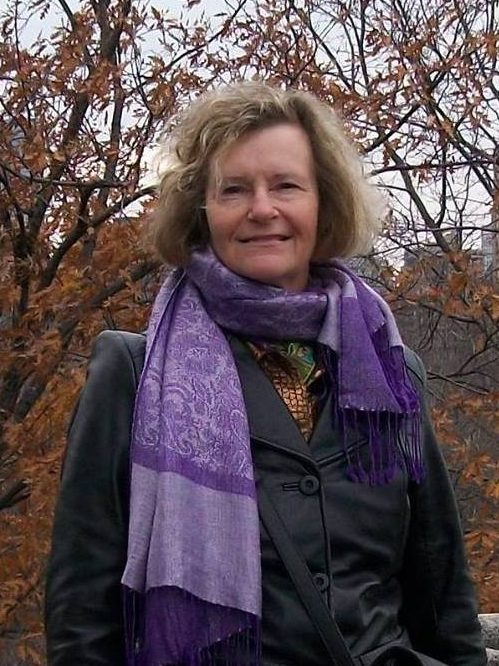
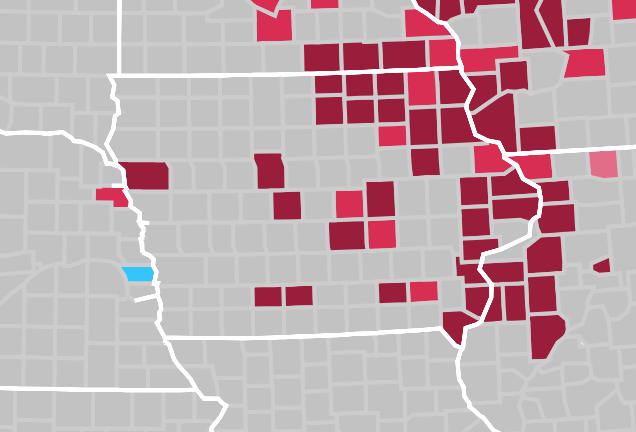
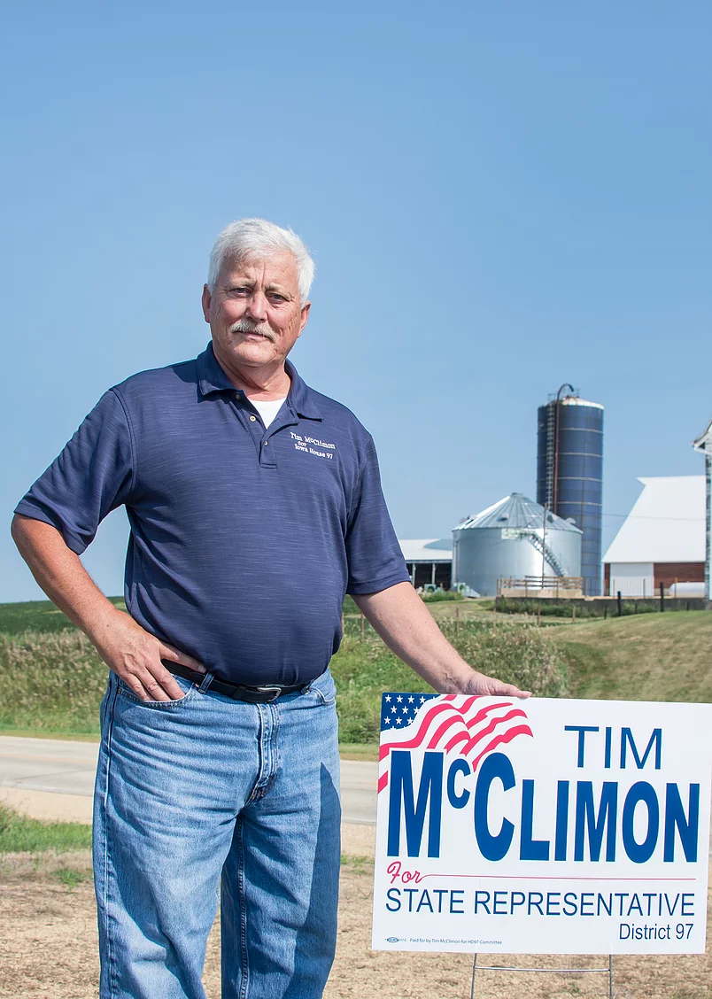
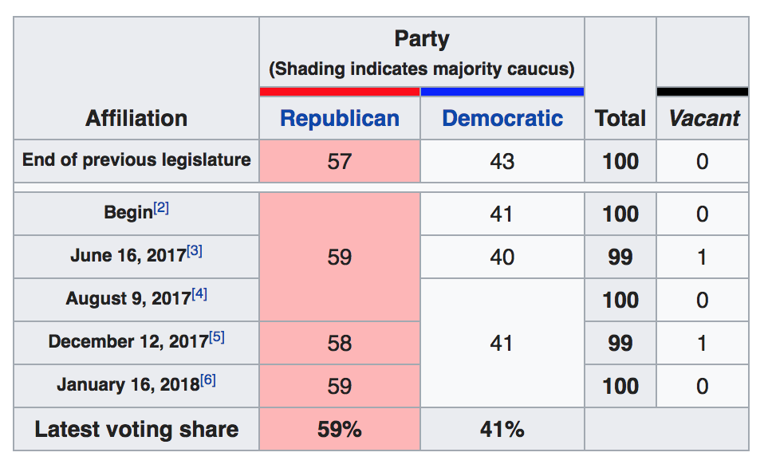

# 2016 Voting Deep Dive

---

## Why did Hillary lose?

* Racism & Whiteness?
* Undereducation
* Poverty
* Jill Stein/Berniebros?

Let's get our hands dirty and really look.

---

##### This is a bad chart.  Are these numbers up or down from 2012?

---

##### Republican Presidential voting increased/decreased in these places

---

##### +Trump voting is kind of related to HS-educated population, but what are those outliers?

---

##### Throwing away ID and UT, things get cleaner, but +Trump voting ~ HS-educated population is still messy

---

##### Mostly, whiteness of county isn't related, but something happens at 93%ish

---

The data is on two entirely different pictures!

We can't even tell which point in each chart matches the other!

What can we possibly do?

---

##### The 3D data is showing a couple distinct phenomena: a steep plane in the corner, and a flatter plane everywhere else.

---

##### One little lie on the previous slide: that's 4D data.  Color is income, yellow is more, purple is less.

---

Whiteness of county _isn't_ as strongly related to +Trump voting in the majority of the chart; HS-education & less (and poverty) are.

---

This is important, because the "Trump supporters are racist" explanation doesn't obviously explain this data.

---

But what about that corner?

---

##### In data from that corner, there are a few distinct hotspots of support

---

##### Drug deaths of despair are hotspots in two of the +Trump zones: KY/OH and MO

+++

##### In data from that corner, there are a few distinct hotspots of support

---

##### If the other hotspot (IA/MN/WI) is responding to racism, why are they 2x Obama counties?

+++

##### In data from that corner, there are a few distinct hotspots of support

---

##### The simple explanation: Trump/Pence visited those people, Hillary/Kaine didn't.

+++

##### In data from that corner, there are a few distinct hotspots of support

---

So what?

---

##### This is Brenda Brink.  She is running in Iowa 49, most of Story county

---

##### This is what she is running on

I believe that our rural communities are worth fighting for because we don’t have an Iowa without them. This campaign is about advocating for the people I’ve known my whole life: everyday Iowans who work hard and want the same opportunities for their kids that they had.

We need to bring our prosperity back home. We need to bring our people back home. We need to bring our values back home. I’m Brenda Brink and I will work to bring it back home.

---

##### These are the Iowa flipped counties

---

##### This is Tim McClimon

---

##### This is what he is running on

I’m running for the Iowa House because I am concerned about the future of our state. I’ve lived my entire life in Clinton County and know there is no better place to live, work and raise a family.

But recently, our state has changed course in a way that has undermined the very things that have always made Iowa strong – a job-ready workforce, world-class education, vibrant rural communities and sound fiscal policies.

I was a parole officer for 38 years in Jackson, Clinton and Scott counties, and I’ve seen firsthand how important smart investments in critical public services are to the health and prosperity of our communities.

---

##### This is the balance of Iowa's state house

