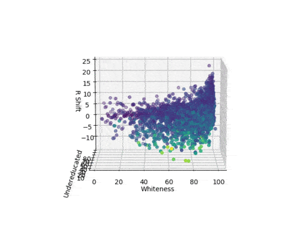

# 2016 Voting Deep Dive

---

## Why did Hillary lose?

* Racism & Whiteness?
* Undereducation
* Poverty
* Jill Stein/Berniebros?

Let's get our hands dirty and really look.

---

##### This is a bad chart.  Are these numbers up or down from 2012?

---

##### Republican Presidential voting increased/decreased in these places

---

##### +Trump voting is kind of related to HS-educated population, but what are those outliers?

---

##### Throwing away ID and UT, things get cleaner, but +Trump voting ~ HS-educated population is still messy

---

##### Mostly, whiteness of county isn't related, but something happens at 93%ish

---

The data is on two entirely different pictures!

We can't even tell which point in each chart matches the other!

What can we possibly do?

---

##### The 3D data is showing a couple distinct phenomena: a steep plane in the corner, and a flatter plane everywhere else.

---

##### One little lie on the previous slide: that's 4D data.  Color is income, yellow is more, purple is less.

---

Whiteness of county _isn't_ as strongly related to +Trump voting in the majority of the chart; undereducation (and poverty) are.

---

This is important, because the "Trumpists are racists!!!" explanation doesn't obviously explain this data.

---

But what about that corner?

---

##### In data from that corner, there are a few distinct hotspots of support

---

##### Drug deaths of despair are hotspots in two of the +Trump zones: KY/OH and MO

---

##### If the other hotspot (IA/MN/WI) is responding to racism, why are they 2x Obama counties?

+++

##### In data from that corner, there are a few distinct hotspots of support

---

##### The simple explanation: Trump/Pence talked to those people, Hillary didn't.

---

"The party of union labor" lost poor, HS-educated labor to Donald Trump.

And our current pitch is "Have you considered not being HS-educated?"

We fix this, or we keep losing.